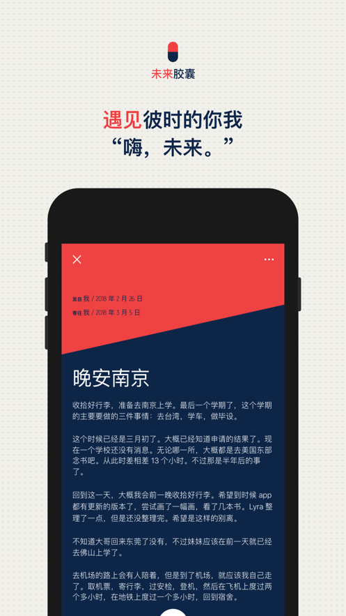
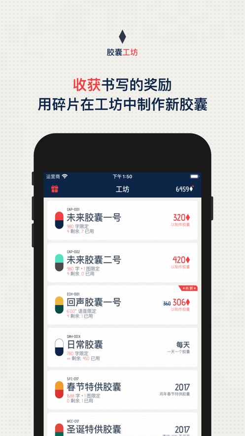

# 概览

产品名称：时间胶囊-写给亲爱未来的日记本

评分：4.9 / 21822

平台：iPhone/iPad

最初上线时间：2017/02/17

应用分类：生活工具

# 功能

## 一句话描述

用户可以给今天或未来的自己写一封信（胶囊），给今天写就是日记，给未来写未来时刻到来才能打开。

## 特色功能：

1. 支持文字、文字+图片、语音三种胶囊格式
2. 往昔时光随机漫步
3. 每天的日记可以按平静、不错、难过三种心情记录，不同的心情胶囊颜色不一样，支持按年统计
4. 日记按时间线和时间格子概览

# 收费

胶囊需要通过胶囊碎片合成，用户有三种方式获得胶囊碎片：

1. 用户每天记录可以获得少量胶囊
2. 观看广告
3. 用户可以购买胶囊碎片

# 截图

# 喜欢

App很简洁，交互做得很好，特别喜欢来信的阅读页面。按碎片合成胶囊的方式设计得很不错，既可以鼓励用户每天做记录获得碎片，也使得胶囊获取方式更加灵活——用户可以使用碎片合成不同得胶囊。